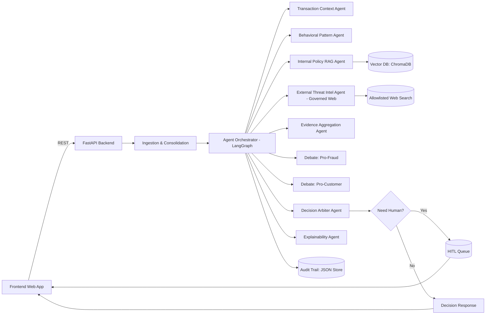
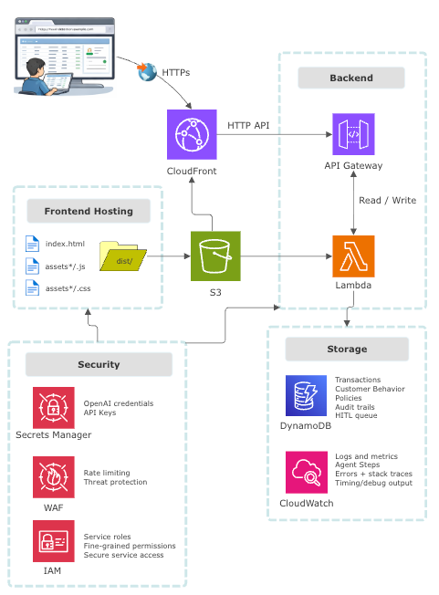
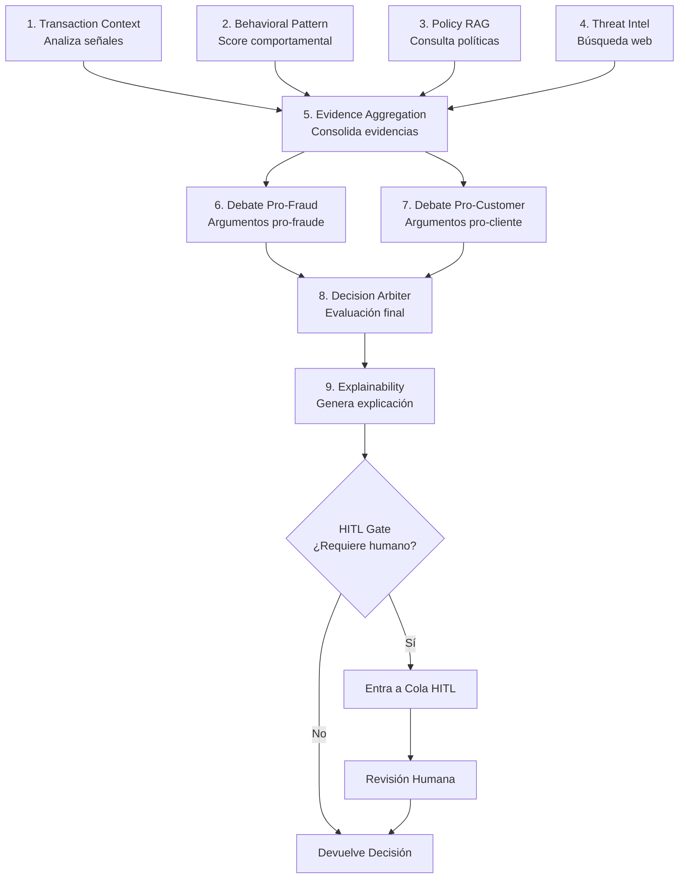

# 🛡️ Sistema Multi-Agente para Detección de Fraude Ambiguo

Sistema inteligente de detección de fraude basado en múltiples agentes de IA, diseñado para analizar transacciones financieras y determinar su legitimidad mediante un flujo de trabajo orquestado con **LangGraph**.

## 📑 Tabla de Contenidos

- [Descripción General](#-descripción-general)
- [Arquitectura del Sistema](#-arquitectura-del-sistema)
- [Cómo Funciona](#-cómo-funciona)
- [Requisitos Previos](#-requisitos-previos)
- [Instalación y Ejecución](#-instalación-y-ejecución)
- [Uso del Sistema](#-uso-del-sistema)
- [API Endpoints](#-api-endpoints)
- [Agentes del Sistema](#-agentes-del-sistema)
- [Datos de Prueba](#-datos-de-prueba)
- [Estructura del Proyecto](#-estructura-del-proyecto)
- [Despliegue en AWS](#-despliegue-en-aws)

---

## 🎯 Descripción General

Las instituciones financieras enfrentan el reto de detectar fraudes en transacciones que presentan **señales ambiguas**: montos inusuales, horarios no habituales, dispositivos desconocidos o patrones de comportamiento atípicos.

Este sistema implementa un **pipeline multi-agente** que:

- ✅ Analiza transacciones en tiempo real
- ✅ Evalúa señales internas (comportamiento, monto, horario, país, dispositivo)
- ✅ Consulta políticas internas mediante **RAG** (base vectorial ChromaDB)
- ✅ Busca inteligencia externa sobre amenazas recientes (búsqueda web gobernada)
- ✅ Orquesta 9 agentes especializados para tomar decisiones trazables
- ✅ Implementa **Human-in-the-Loop (HITL)** para casos ambiguos
- ✅ Genera explicaciones en lenguaje natural para clientes y auditoría

## 🌐 URLs de Despliegue (actual)

- Frontend (CloudFront): https://dedwt6o9pc0lp.cloudfront.net
- Backend API (API Gateway): https://jlht5nxlh8.execute-api.us-east-1.amazonaws.com
  - Swagger: https://jlht5nxlh8.execute-api.us-east-1.amazonaws.com/docs

---

## 🏗️ Arquitectura del Sistema



### Stack Tecnológico

| Componente | Tecnología |
|------------|------------|
| **Backend** | Python 3.11, FastAPI, LangGraph |
| **Frontend** | React 18, TypeScript, MUI |
| **Vector Store** | ChromaDB |
| **LLM** | OpenAI GPT-4o-mini (configurable) |
| **Orquestación** | LangGraph (StateGraph) |
| **Contenedores** | Docker, Docker Compose |

### Arquitectura en AWS

El sistema está **desplegado en producción** en AWS usando una arquitectura serverless completa:

<p align="center">
  
</p>

#### Componentes Principales

**Frontend (CloudFront + S3)**
- Aplicación React servida globalmente via CloudFront
- Baja latencia y alta disponibilidad
- HTTPS automático con certificado SSL
- URL: https://dedwt6o9pc0lp.cloudfront.net

**Backend (Lambda Container + API Gateway)**
- FastAPI corriendo en Lambda Container (Python 3.11)
- 5 minutos de timeout para análisis multi-agente complejo
- 2GB RAM para procesamiento de embeddings y LLM
- Escalado automático según demanda
- API Gateway HTTP API para enrutamiento
- URL: https://jlht5nxlh8.execute-api.us-east-1.amazonaws.com

**Almacenamiento**
- **DynamoDB** (3 tablas): Transacciones, Audit Trail, Casos HITL
- **S3**: Input files (CSVs, políticas JSON)
- **ChromaDB en /tmp**: Vector store efímero (se reconstruye por invocación)

**Observabilidad**
- CloudWatch Logs para troubleshooting
- CloudWatch Alarms para errores y throttling
- X-Ray tracing habilitado

**Costos Estimados**: ~$7-10/mes para 1000 transacciones/día (Free Tier aplica el primer año)

---

## 🔄 Cómo Funciona

### Flujo de Análisis de una Transacción

1. **Ingesta**: El sistema carga transacciones, comportamiento de clientes y políticas de fraude
2. **Consolidación**: Se une la información de transacción con el perfil del cliente
3. **Pipeline Multi-Agente**: La transacción pasa por 9 agentes especializados:

```
Transaction Context → Behavioral Pattern → Policy RAG → Threat Intel
        ↓
Evidence Aggregation → Debate (Pro-Fraud vs Pro-Customer) → Arbiter
        ↓
Explainability → HITL Gate → Decision
```

4. **Decisión**: El sistema genera una de 4 posibles decisiones:

| Decisión | Descripción | Confianza Típica |
|----------|-------------|------------------|
| `APPROVE` | Transacción legítima | < 0.45 |
| `CHALLENGE` | Requiere validación adicional (OTP, biometría) | 0.45 - 0.75 |
| `BLOCK` | Bloquear por alta sospecha de fraude | ≥ 0.75 |
| `ESCALATE_TO_HUMAN` | Revisión humana obligatoria | Cualquiera (por política) |

5. **Explicabilidad**: Se genera un informe detallado con:
   - Explicación para el cliente (lenguaje simple)
   - Resumen de auditoría (técnico)
   - Reporte de IA con 6 secciones estructuradas

6. **HITL**: Si se requiere intervención humana, el caso entra en la cola HITL

### Ejemplo de Respuesta

```json
{
  "decision": "CHALLENGE",
  "confidence": 0.65,
  "signals": ["Monto fuera de rango", "Horario no habitual"],
  "citations_internal": [
    { "policy_id": "FP-01", "chunk_id": "1", "version": "2025.1" }
  ],
  "citations_external": [
    { "url": "https://example.com/alert", "summary": "Alerta de fraude en merchant" }
  ],
  "explanation_customer": "La transacción requiere validación adicional.",
  "explanation_audit": "Se aplicó política FP-01. Ruta: Context → RAG → Debate → Decisión",
  "ai_summary": "## Informe Detallado...",
  "hitl": { "required": false, "reason": "" }
}
```

---

## 📋 Ejecución en Local

### Para ejecución con Docker (Recomendado)

- **Docker** 20.10+ 
- **Docker Compose** v2.0+
- **4GB RAM** mínimo disponible

### Para desarrollo local

- **Python** 3.11+
- **uv** (gestor de dependencias) o **pip**
- **Node.js** 18+
- **npm** 9+
- **OpenAI API Key** (para modo LLM real)

---

## 🚀 Instalación y Ejecución

### Opción 1: Docker Compose (Recomendado)

```bash
# 1. Clonar el repositorio
git clone <repo-url>
cd desafio_tecnico_AI_developer_CH

# 2. Crear archivo de configuración
cp backend/.env.example backend/.env
# Editar backend/.env y agregar tu OPENAI_API_KEY

# 3. Construir e iniciar servicios
make build
make up

# O con docker compose directamente:
docker compose up --build
```

**Acceder a:**
- 🌐 **Frontend**: http://localhost:5173
- 🔌 **Backend API**: http://localhost:8000
- 📚 **API Docs (Swagger)**: http://localhost:8000/docs

### Opción 2: Desarrollo Local

#### Backend

```bash
cd backend

# Opción A: Usar uv (recomendado)
uv venv
source .venv/bin/activate  # Linux/Mac
# Windows: .venv\Scripts\activate
uv sync

# Opción B: Usar pip tradicional
python -m venv venv
source venv/bin/activate  # Linux/Mac
# Windows: venv\Scripts\activate
pip install -r requirements.txt

# Configurar variables de entorno
cp .env.example .env
# Editar .env con tus credenciales

# Crear estructura de directorios para almacenamiento
mkdir -p ../.storage/state
mkdir -p ../.storage/vectors
mkdir -p ../.storage/input

# Copiar archivos de datos de ejemplo
cp ../data/* ../.storage/input/

# Variables mínimas requeridas:
export APP_ENV=local
export DATA_DIR=../.storage/input
export STORE_DIR=../.storage/state
export VECTOR_DIR=../.storage/vectors
export OPENAI_API_KEY=tu-api-key  # Opcional: usa modo mock sin esto

# Ejecutar servidor
uvicorn app.main:app --reload --host 0.0.0.0 --port 8000
```

#### Frontend

```bash
cd frontend

# Instalar dependencias
npm install

# Configurar API URL (opcional, default: localhost:8000)
echo "VITE_API_BASE_URL=http://localhost:8000" > .env

# Ejecutar en modo desarrollo
npm run dev
```

### Comandos Make Disponibles

```bash
make help          # Ver todos los comandos disponibles
make build         # Construir imágenes Docker
make up            # Iniciar servicios
make down          # Detener servicios
make rebuild       # Reconstruir sin cache
make logs          # Ver logs de todos los servicios
make logs-backend  # Ver solo logs del backend
make test-backend  # Ejecutar tests
make clean         # Limpiar contenedores y volúmenes
```

---

## 📋 Uso del Sistema

### Paso 1: Cargar Datos

**Antes de iniciar**, colocar los archivos de entrada en la carpeta `.storage/input/`:
- 📄 `transactions.csv` - Transacciones a analizar
- 👤 `customer_behavior.csv` - Perfiles de comportamiento de clientes
- 📜 `fraud_policies.json` - Políticas de fraude para RAG

```bash
# Crear carpeta y copiar archivos de ejemplo
mkdir -p .storage/input
cp data/* .storage/input/
```

Luego, en la aplicación web, hacer clic en **"Cargar Datos"** en la página principal.

```bash
# O via API:
curl -X POST http://localhost:8000/ingest
```

### Paso 2: Analizar Transacciones

**Opción A - Individual**: Click en "Analizar" junto a cada transacción

**Opción B - Masivo**: Click en "Analizar Pendientes" para procesar todas

```bash
# Via API:
curl -X POST http://localhost:8000/transactions/T-2001/analyze
curl -X POST http://localhost:8000/transactions/analyze-all
```

### Paso 3: Ver Resultados

- **Lista de Transacciones**: Estado, decisión, confianza de cada una
- **Detalle de Transacción**: 
  - Señales detectadas
  - Evidencias (políticas, alertas externas)
  - Informe de IA detallado
  - Audit Trail completo con duración por agente
- **Cola HITL**: Casos pendientes de revisión humana

### Paso 4: Resolver Casos HITL

1. Ir a "Cola HITL"
2. Seleccionar caso a resolver
3. Elegir decisión final (APPROVE, CHALLENGE, BLOCK)
4. Agregar notas de resolución
5. Confirmar

---

## 🔧 API Endpoints

| Método | Endpoint | Descripción |
|--------|----------|-------------|
| `POST` | `/ingest` | Cargar datos desde archivos |
| `GET` | `/transactions` | Listar todas las transacciones |
| `GET` | `/transactions/{id}` | Detalle de transacción con audit trail |
| `POST` | `/transactions/{id}/analyze` | Analizar una transacción |
| `POST` | `/transactions/analyze-all` | Analizar todas las pendientes |
| `GET` | `/hitl` | Listar casos HITL abiertos |
| `POST` | `/hitl/{case_id}/resolve` | Resolver caso HITL |
| `GET` | `/health` | Health check del sistema |

### Ejemplo de Uso con cURL

```bash
# Health check
curl http://localhost:8000/health

# Cargar datos
curl -X POST http://localhost:8000/ingest

# Listar transacciones
curl http://localhost:8000/transactions

# Analizar transacción específica
curl -X POST http://localhost:8000/transactions/T-2002/analyze

# Ver detalle con audit trail
curl http://localhost:8000/transactions/T-2002

# Resolver caso HITL
curl -X POST http://localhost:8000/hitl/HITL-xxx/resolve \
  -H "Content-Type: application/json" \
  -d '{"decision": "APPROVE", "notes": "Verificado con cliente"}'
```

---

## 🤖 Agentes del Sistema

El sistema implementa **9 agentes especializados** orquestados con LangGraph:

| # | Agente | Función |
|---|--------|---------|
| 1 | **Transaction Context** | Analiza señales de la transacción (monto, horario, país, dispositivo) comparando con el comportamiento habitual del cliente |
| 2 | **Behavioral Pattern** | Calcula score de riesgo comportamental basado en desviaciones del patrón histórico |
| 3 | **Policy RAG** | Consulta políticas internas de fraude via RAG (ChromaDB) y extrae reglas aplicables |
| 4 | **Threat Intel** | Búsqueda web gobernada (allowlist) de alertas externas sobre merchants, países o patrones |
| 5 | **Evidence Aggregation** | Consolida todas las señales, métricas y evidencias recopiladas |
| 6 | **Debate Pro-Fraud** | Argumenta a favor de la detección de fraude basándose en las evidencias |
| 7 | **Debate Pro-Customer** | Argumenta a favor del cliente citando historial limpio y patrones normales |
| 8 | **Decision Arbiter** | Evalúa argumentos de debate, aplica umbrales y toma la decisión final |
| 9 | **Explainability** | Genera explicaciones en lenguaje natural para cliente, auditoría e informe de IA |

### Flujo de Ejecución



---

## 🧪 Datos de Prueba

El sistema incluye **4 transacciones** diseñadas para demostrar cada tipo de decisión:

| ID | Cliente | Monto | País | Hora | Decisión Esperada | Razón |
|----|---------|-------|------|------|-------------------|-------|
| T-2001 | CU-201 | 450 PEN | PE | 14:30 | `APPROVE` | Dentro de patrones normales |
| T-2002 | CU-202 | 8500 PEN | PE | 02:15 | `CHALLENGE` | Monto 7x mayor + horario nocturno |
| T-2003 | CU-203 | 3200 PEN | CO | 11:00 | `ESCALATE_TO_HUMAN` | País nuevo + dispositivo nuevo |
| T-2004 | CU-204 | 12000 PEN | PE | 23:45 | `BLOCK` | Monto extremo + merchant con alerta |

### Comportamiento de Clientes de Prueba

| Cliente | Monto Promedio | Horario Habitual | Países | Dispositivos |
|---------|----------------|------------------|--------|--------------|
| CU-201 | 500 PEN | 08:00 - 20:00 | PE | D-201 |
| CU-202 | 1200 PEN | 09:00 - 22:00 | PE | D-202 |
| CU-203 | 800 PEN | 10:00 - 18:00 | PE | D-203 |
| CU-204 | 2000 PEN | 08:00 - 21:00 | PE | D-204 |

---

## 📁 Estructura del Proyecto

```
.
├── backend/
│   ├── app/
│   │   ├── agents/           # 9 agentes especializados
│   │   │   ├── transaction_context.py
│   │   │   ├── behavioral_pattern.py
│   │   │   ├── policy_rag.py
│   │   │   ├── threat_intel.py
│   │   │   ├── evidence_aggregation.py
│   │   │   ├── debate.py
│   │   │   ├── arbiter.py
│   │   │   └── explainability.py
│   │   ├── api/              # FastAPI routes y schemas
│   │   ├── core/             # Config, logging, LLM service
│   │   ├── data/             # Loader de datos CSV/JSON
│   │   ├── orchestration/    # LangGraph state y graph builder
│   │   ├── prompts/          # Prompts YAML (español)
│   │   ├── rag/              # ChromaDB vector store
│   │   ├── storage/          # Repositorios (JSON local)
│   │   └── web/              # Búsqueda web gobernada
│   ├── tests/
│   ├── Dockerfile
│   ├── requirements.txt
│   └── .env.example
├── frontend/
│   ├── src/
│   │   ├── api/              # Cliente Axios
│   │   ├── components/       # React components
│   │   │   ├── AuditTimeline.tsx
│   │   │   ├── SignalsChips.tsx
│   │   │   └── ConfidenceBar.tsx
│   │   ├── pages/            # Vistas principales
│   │   │   ├── Transactions.tsx
│   │   │   ├── TransactionDetail.tsx
│   │   │   └── HitlQueue.tsx
│   │   └── types.ts
│   ├── public/               # Assets estáticos
│   ├── Dockerfile
│   └── package.json
├── data/                     # Datos de ejemplo (copiar a .storage/input para usar)
│   ├── transactions.csv      # Ejemplo de transacciones
│   ├── customer_behavior.csv # Ejemplo de perfiles de clientes
│   └── fraud_policies.json   # Ejemplo de políticas de fraude
├── .storage/                 # Datos persistidos (gitignored, creado automáticamente)
│   ├── input/               # Archivos de entrada del sistema (CSV/JSON)
│   │   ├── transactions.csv      # Transacciones a analizar
│   │   ├── customer_behavior.csv # Perfiles de comportamiento
│   │   └── fraud_policies.json   # Políticas para RAG
│   ├── state/               # Decisiones y casos HITL guardados (JSON/JSONL)
│   │   ├── decisions/       # Decisiones de análisis por transacción
│   │   ├── audit_trails/    # Logs de ejecución de agentes (JSONL)
│   │   └── hitl_cases/      # Casos pendientes de revisión humana
│   └── vectors/             # ChromaDB embeddings y metadata
│       └── chroma.sqlite3   # Base de datos vectorial de políticas
├── docker-compose.yml
├── Makefile
├── design.md                 # Documento de diseño detallado
└── README.md
```

---

## 🔒 Seguridad y Gobernanza

- **Web Search Allowlist**: Solo dominios autorizados para búsqueda externa
  - `example.com`, `owasp.org`, `mitre.org`, `cve.mitre.org`
- **Audit Trail Completo**: Cada paso del análisis queda registrado con:
  - Timestamp, duración, entrada/salida de cada agente
  - Agrupación por `run_id` para re-análisis
- **Human-in-the-Loop**: Casos con baja confianza o por política requieren aprobación humana
- **Explicabilidad**: Todas las decisiones incluyen justificación auditable

---

## 🚀 Próximos Pasos

### Infraestructura
- **Amazon OpenSearch Serverless**: Migrar de ChromaDB a OpenSearch con k-NN engine para búsqueda vectorial nativa, eliminando dependencia de `/tmp/` y cold starts
- **Amazon Bedrock**: Reemplazar OpenAI con Claude 3 + Titan Embeddings para reducir costos y mantener datos en AWS
- **Multi-Region**: Despliegue en us-east-1, us-west-2, eu-west-1 para menor latencia global

### Escalabilidad
- **EventBridge + SQS**: Procesamiento asíncrono para alto volumen de transacciones
- **Lambda Provisioned Concurrency**: Eliminar cold starts en horarios pico

### Inteligencia
- **Fine-tuning**: Entrenar modelos con histórico de decisiones HITL aprobadas
- **Graph Neural Networks**: Detección de redes de fraude con Amazon Neptune ML
- **Feedback Loop**: Actualización automática de políticas RAG basado en resultados

### Observabilidad
- **AWS X-Ray Service Map**: Visualización completa del flujo multi-agente
- **CloudWatch Dashboards**: Métricas de precisión, recall, latencia p99, fraud rate

### Seguridad
- **VPC Endpoints**: Comunicación privada entre servicios AWS
- **Secrets Rotation**: Rotación automática de API keys


